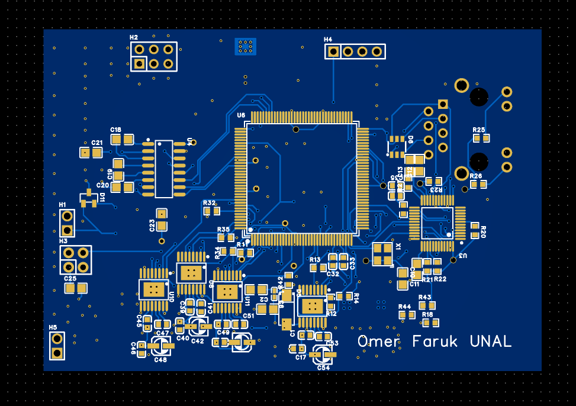
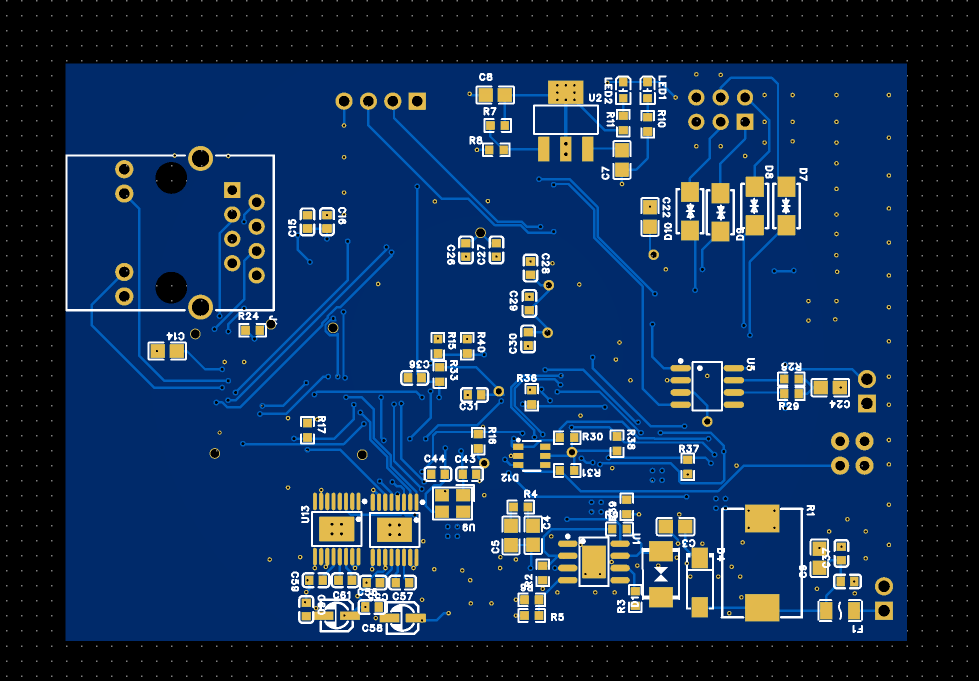

# 6-DOF-Robot-ARM-Main-BOARD
This project features a custom-designed, industrial-grade control board specifically engineered for precision 6-axis robot arm applications. Powered by the **STM32F407ZGT6** (Cortex-M4) microcontroller, this board integrates high-speed communication interfaces with robust motor driving capabilities.

## 🚀 Key Features

### 🔌 Connectivity & Communication
* **Ethernet (10/100 Mbps):** Integrated PHY for high-speed industrial networking and remote control.
* **CAN-Bus:** Reliable inter-module communication with dedicated ESD protection for harsh environments.
* **RS232 Interface:** Standard serial communication for legacy systems and debugging.
* **I2C Bus:** Multi-device sensor support with dedicated pull-up infrastructure.

### ⚙️ Motion Control
* **6-Axis Independent Driving:** Equipped with H-Bridge motor drivers, supporting up to 28V and high-current peaks.
* **Real-time Feedback:** Advanced infrastructure for Magnetic encoders or Hall sensors, enabling closed-loop control and precise positioning.
* **Current Sensing:** Individual current feedback (IPROPI) for each axis to monitor load and prevent stall conditions.
* **Fault Diagnostics:** Separate hardware fault reporting for each driver to ensure system safety.

### 🛡️ Hardware Design & Protection
* **4-Layer PCB Architecture:** Optimized stackup with dedicated Power and Ground planes to minimize EMI/EMC noise.
* **ESD & Surge Protection:** TVS diode arrays on all communication lines (Ethernet, CAN, RS232) and power inputs.
* **Advanced Power Management:** High-efficiency DC-DC buck regulation combined with low-noise LDOs for stable logic supply.

## 🛠 Tech Stack
* **Microcontroller:** STM32F407ZGT6 (168 MHz)
* **EDA Tool:** EasyEDA Professional
* **PCB Specs:** 4-Layer, FR4, Impedance Controlled

---

## 📷 Gallery
| Top Side | Bottom Side |
| :---: | :---: |
|  |  |

## 🔒 Project Status
**Note:** This is a proprietary project. The hardware schematics and firmware source code are **not open-source**. This repository serves as a portfolio showcase to demonstrate engineering capabilities in embedded systems, PCB layout, and robotics control.

---
**Designed & Developed by:** **Omer Faruk UNAL** *Electrical-Electronics Engineer*
